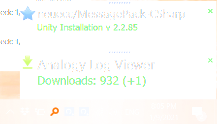
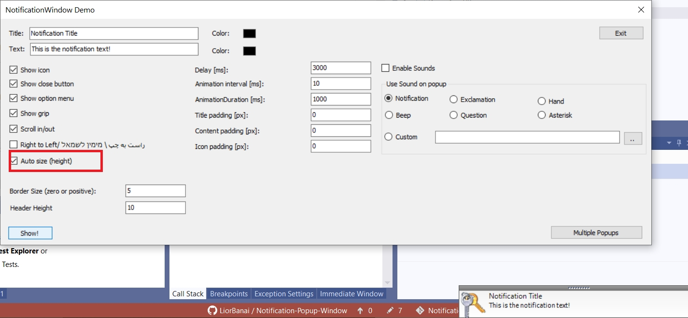

# Notification Popup Window
### A notification window that appears on the lower right part of the screen for .NET

   [](https://www.nuget.org/packages/LiorBanai.NotificationWindow/)   
<a href="https://github.com/LiorBanai/Notification-Popup-Window/issues">
    
</a>
<a href="https://github.com/LiorBanai/Notification-Popup-Window/blob/master/LICENSE">
    
</a>
   [](https://www.nuget.org/packages/LiorBanaI.NotificationWindow/)
<a href="https://github.com/LiorBanai/Notification-Popup-Window/releases"> 
    
</a> 
 <a href="https://github.com/LiorBanai/Notification-Popup-Window/compare/V1.2.0...master">
    
</a>
       




This project is based on a [Notification Window](http://www.codeproject.com/Articles/277584/Notification-Window) created in 2011 by Simon Baer. It is also base in [Office 2003-like popup notifier](http://www.codeproject.com/Articles/13547/An-Office-like-popup-notifier) created in 2006 by Nicolas Wälti.

### Features:
- Scroll and/or fade window in and out
- Configure the animation speed and the time the window is displayed
- Display a custom icon
- Set title and content text, font, size, and color
- Set all paddings around icon, title and content
- Sptionally display a close button
- Optionally display a button which opens a context menu
- Supports right to left languages like Persian,Arabic and Hebrew.
- (new) Supports multiple popups at the same time.
- (new) Supports Not showing popup when other program is running in full screen mode
- (new) Add sound notification.
- (new) Support Auto Size:



### How to use it
Download from the release section (or use nuget: https://www.nuget.org/packages/LiorBanai.NotificationWindow/) and use it this way:
```cs
var popupNotifier = new PopupNotifier();
popupNotifier.TitleText = "Title of popup";
popupNotifier.ContentText  = "Content text";
popupNotifier.IsRightToLeft = false;
popupNotifier.Popup();


```
